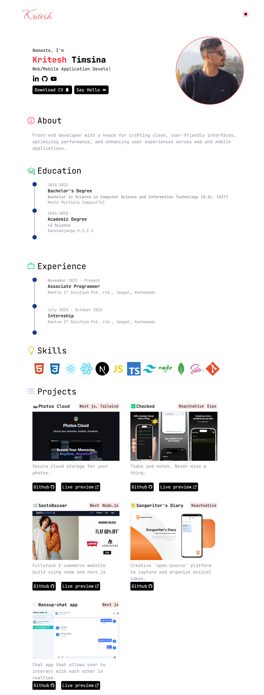

# 🚀 Open Source Portfolio Website

A beautiful, responsive, and **easily customizable** portfolio website built with **React** and **Tailwind CSS**. Designed for developers, students, and creatives to showcase their work with zero coding hassle!



---

## 🌟 Features

- ⚡ Built with **React** and **Tailwind CSS**
- 📱 Fully **responsive** and **modern design**
- 📝 Content managed using simple **constant files**
- 💼 Sections for **projects**, **experience**, **education**, and more
- 🧩 Clean and modular codebase
- 🌞 Dark/Light mode

---

## ⌚ Under Implementation

- 📖 Blog platform for sharing post
- 🔒 Admin Panel

## ⚙️ Getting Started

### 1. 📦 Clone the Repository

```bash
git clone https://github.com/KriteshTimsina/portfolio-v2.git
cd portfolio-v2
```

> Replace the URL with your actual repository if different.

---

### 2. 🛠️ Install Dependencies

Make sure you have Node.js installed. Then run:

```bash
npm install
```

---

### 3. 🚀 Start the Development Server

```bash
npm run dev
```

Your site will be running at `http://localhost:5173`.

---

## 📝 How to Customize the Website

All content is editable through simple constant files — no coding skills required!

Navigate to:

```bash
/src/constants/data
```

Open the files below and replace the sample content with your own:

---

### 🧑 `details.ts`

Your personal details:

```ts
export const details = {
  firstName: "YourFirstName",
  lastName: "YourLastName",
  roles: ["Role 1", "Role 2"],
  introduction: `Short intro about yourself.`,
  email: "your@email.com",
};
```

---

### 🎓 `education.ts`

Add your education history:

```ts
export const education = [
  {
    startDate: "2018",
    endDate: "2022",
    degree: "Bachelor's Degree",
    course: "B.Sc. CSIT",
    institution: "Your Institution Name",
  },
  // Add more if needed
];
```

---

### 💼 `experiences.ts`

List your professional experiences:

```ts
export const experiences = [
  {
    startDate: "Nov 2023",
    endDate: "Present",
    designation: "Your Position",
    company: "Your Company",
    address: "Company Address",
  },
];
```

---

### 💻 `projects.ts`

Showcase your projects:

```ts
export const projects = [
  {
    id: 1,
    icon: "📸",
    title: "Project Title",
    description: "Short description of the project.",
    image: images.projectImage, // image stored in /assets folder
    url: "https://live-project-url.com",
    github: "https://github.com/your/project", //leave empty if the repository is private
    techStacks: ["React", "Tailwind"],
    category: "React",
  },
  // Add more projects
];
```

Make sure your images are available inside the `/assets` folder and imported properly in the file.

---

## 🖼️ How to Change Project Images, Logo & Hero Image

All images and icons used in the website are located in:

```
/src/assets/images
/src/assets/icons
```

### 🔄 To Replace an Image or Icon:

1. **Go to the folder**:

   - Project or hero images: `/src/assets/images/`
   - Icons: `/src/assets/icons/`

2. **Replace the file**:
   - Keep the **same file name** (e.g., `logo.png`, `heroImage.jpg`, `project-1.png`,`project-2.png`) to avoid changing any code.
   - Alternatively, if you want to use a **new file name**, update the relevant entry in the `images` or `icons` export file.

### 🧠 Example - Changing Logo:

**Step 1:** Replace `logo.png` with your own logo in `/assets/icons/`.

**Step 2:** The logo is imported here:

```ts
import logo from "./logo.png";

export const icons = {
  ...logo,
};
```

No other change is needed if the name stays the same.

---

### 🧠 Example - Changing Hero Image:

**Step 1:** Replace `heroImage.jpg` with your own image in `/assets/images/`.

**Step 2:** The image is used in the `images` object:

```ts
import heroImage from "./heroImage.jpg";

export const images = {
  ...heroImage,
};
```

---

### 💡 Tip

If you're adding a **new image**, import it and register it like this:

```ts
import newProjectImage from "./new-project.png";

export const images = {
  ...
  newProject: newProjectImage,
};
```

Then, use `images.newProject` in your project object inside `projects.ts`.

## 📁 Folder Structure Overview

```
src/
├── assets/         # Project assets (images and resume)
├── components/     # UI components
├── constants/      # Editable content files
├── pages/          # Website pages
└── App.tsx         # Root component
```

---

## 📦 Build for Production

```bash
npm run build
```

---

## 🌐 Deployment

You can deploy this project easily using:

- **[Vercel](https://vercel.com)**
- **[Netlify](https://netlify.com)**
- **GitHub Pages** (with additional config)

---

## 🤝 Contributing

Want to improve this template or add features? Contributions are welcome!

1. Fork the repo
2. Create your branch: `git checkout -b feature-name`
3. Commit your changes: `git commit -m 'Add feature'`
4. Push and create a Pull Request

---

## 📄 License

This project is licensed under the **MIT License** — feel free to use, share, and modify.

---

## 🙌 Connect

If you like this project, don't forget to ⭐ the repo!

Made with 💙 by [Kritesh Timsina](https://github.com/KriteshTimsina)
